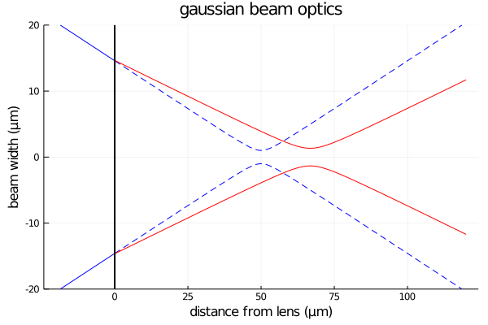

# Thermal lens effect simulation

When a powerful Gaussian beam propagates into an absorbing medium, it heats the center, creating a temperature gradient and thus an index gradient. This gradient deflect the light rays in a divergent way.



> effect of a diverging lens on a Gaussian beam

This phenomenon known as "thermally induced GRIN lens effect" or "thermal lens effect" has been described analytically for thin medium [[98][99]](#References). Here, I extend this to a thick medium through a Gaussian beam propagation simulation.


## Usage

The code contains a `GaussianBeam` module and a `GrinLens` module. Here I explain an example code for generating the following figure. You will find other examples in the `gaussian-beam` folder along with generated figures.


First, we import the needed code and define the parameters of the simulation (defaults parameters can be found in the `grinlens.jl` file).

```julia
include("./grinlens.jl")
using .Grinlens

exppows = [0.213, 0.248, 0.284, 0.319, 0.355] # experimental powers in watt
P = map(p -> Parameters(P=p, l=1e-6, w0=4e-6, n=1.33), exppows) # parameter vector
```

Then, we apply the propagation on the parameter vector we just generated.

```julia
O = propagate.(P) # run the simulation for these parameters
```

Then we use the observables we need to plot our figure (cosmetic code removed). The units are S.I. and are documented in the `grinlens.jl` file, thus the conversion in mm/µm.

```julia
using Plots
plot()
for (i,pow) in enumerate(exppows) # loop over results
    plot!((P[i].steps).*1e3, + O[i].wonlens.*1e6) # mm / µm
end
title!("beam profiles")
xlabel!("position in tank (mm)")
ylabel!("beam width at 1/e (µm)")
```

Don't hesitate to file an issue for any comment or question.

## Comparison with measurements

This numerical model fits well with my experimental measurements as described in my PhD manuscript.


> comparison of numerical simulation with real world measurements 

## References

References from my [PhD thesis](https://github.com/Hugo-Trentesaux/these_latex):

[98] J. R. Whinnery (1974); *Laser measurement of optical absorption in liquids* https://pubs.acs.org/doi/abs/10.1021/ar50079a003. 


[99] J. P. Gordon, R. C. C. Leite, R. S. Moore, S. P. S. Porto & J. R. Whinnery (1965); *Long‐Transient Effects in Lasers with Inserted Liquid
Samples* http://aip.scitation.org/doi/10.1063/1.1713919