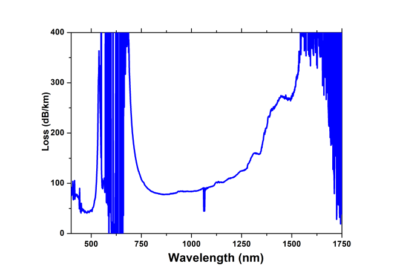
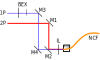
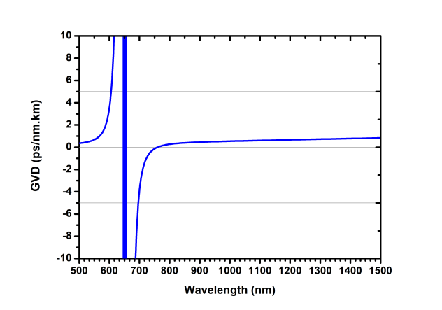
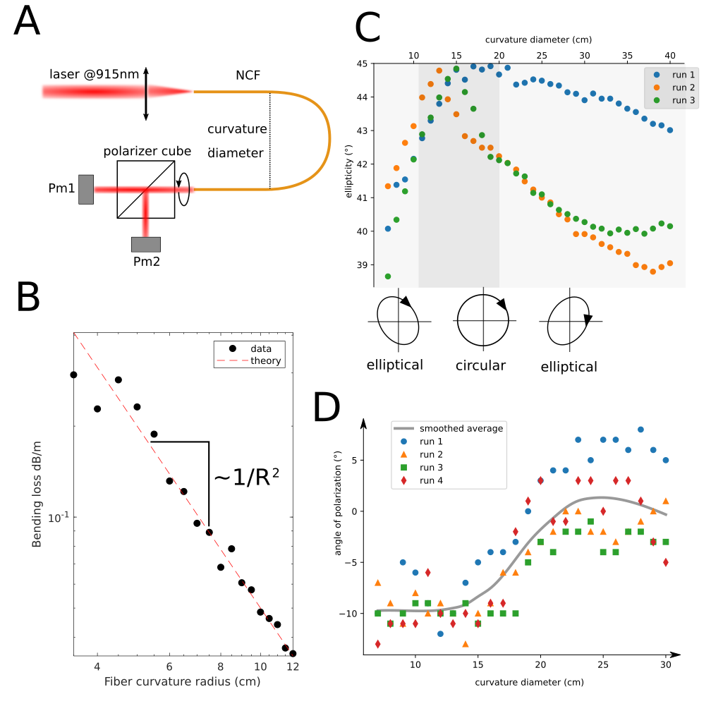
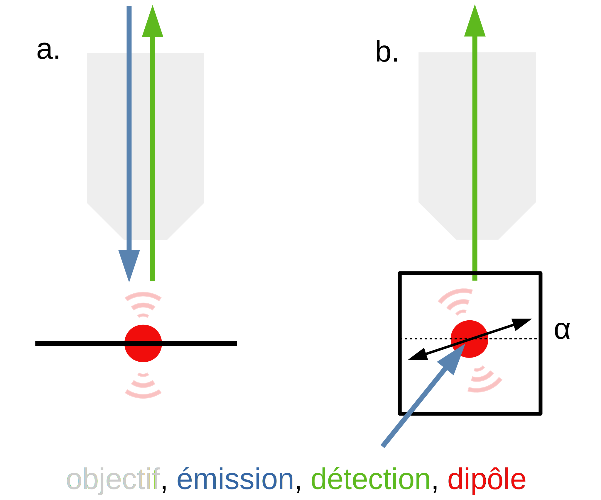
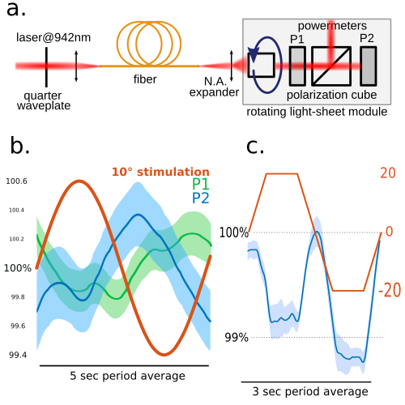

# Fibre

Pour faire fonctionner un microscope optique, il faut illuminer l'échantillon. Pour un éclairage en lumière blanche par transmission, une lampe est généralement combinée à un système optique tel que l'illumination de Köhler [1]. Pour la microscopie de fluorescence, on peut utiliser des sources comme les lampes à décharge qui émettent fortement à une longueur d'onde précise, mais on préfère aujourd'hui les lasers pour leur durée de vie, leur puissance, leur finesse spectrale et autres qualités. Il s'agit donc de guider un laser vers l'échantillon fluorescent de manière à réaliser l'imagerie.

Dans un microscope statique, la source laser peut être intégrée et guidée par des miroirs jusqu'à l'échantillon, mais dans le cas d'un microscope mobile ou d'une source laser encombrante, il faut une autre solution. C'est justement notre cas avec à la fois une source laser très volumineuse et un microscope mobile. La solution utilisée dans ce cas pour la microscopie un photon est la fibre optique. Nous allons voir son principe de fonctionnement et comment il peut s'appliquer à la microscopie deux photons.

## Guide d'onde

Un guide d'onde est un objet contraignant l'onde à se propager dans une seule dimension. Pour les ondes électromagnétiques dans les fréquences radio, cela peut être réalisé avec des parois métalliques. Dans le cas de la lumière visible, on utilise généralement une âme d'indice optique supérieur à l'indice du milieu environnant. Le phénomène de réflexion totale sur le dioptre permet alors le guidage de l'onde. De telles fibres optiques sont réalisées avec un fin fil de verre et servent en télécommunication, en éclairage, en imagerie...

Nous disposons notamment de fibres monomodes qui permettent de transmettre le mode fondamental d'un laser d'un bout à l'autre sans dénaturer le profil gaussien. Nous utilisons ce genre de fibre pour guider le laser dans la version un photon du microscope à feuille de lumière rotatif.

Dans le cas d'un laser pulsé utilisé en microscopie deux photons, les fibres à milieu d'indice fonctionnent également mais ont un inconvénient majeur qui les rend inutilisables pour cette application dû au phénomène de dispersion. Un laser pulsé a contient d'autant plus de longueurs d'ondes que son pic est étroit.
$$
\Delta \lambda_t = \frac{\lambda^2}{c}\Delta\nu_t
$$
Dans un milieu dispersif, ces différentes longueurs d'onde se propagent à une vitesse différente, ce qui donne lieu à un élargissement de l'impulsion. L'effet deux photons étant lié quadratiquement à la puissance instantanée, il chute de manière critique avec la dispersion. C'est pourquoi il faut un guide d'onde avec un milieu de propagation non dispersif.

## Fibre à âme creuse

Un milieu non dispersif courant est l'air ou le vide, d'où l'idée de construire un guide d'onde à cœur creux. L'effet de réflexion totale sur le dioptre ne peut plus être utilisé, car il faudrait un milieu d'indice plus petit que 1, c'est à dire dans lequel la lumière se propage plus vite que dans le vide, ce qui n'est pas possible. Une idée consiste donc à utiliser un phénomène de réflexion par interférences comme le miroir de Bragg. Un tel miroir est constitué d'une succession périodique de couches d'indice différents et permet d'obtenir une réflexion quasi totale à la longueur d'onde du motif. On trouve ce genre de réseau dans des fibres microstructurées dès 2005 [7].

Cette idée a également donné lieu aux fibres à réseau trihexagonal, ou "Kagomé". De telles fibres ont été construites pour la première fois en 2002 sous le nom de fibre à cristaux photoniques en étirant un réseau de capillaires. Le gain était alors de l'ordre de 2 dB/m [3]. En 2011, un gain de 180 dB/km a été obtenu avec de telles fibres [4]. Un des problèmes des fibres à structure géométrique est la sensibilité aux déformations. Puisque le guidage est lié à la géométrie de la fibre, les déformations qui changent cette géométrie altèrent le guidage. Cela peut prendre la forme de perte de transmission, de couplage entre les modes, d'incidence sur la polarisation. Mais cette sensibilité aux déformations dépendant de la géométrie de la fibre, certaines configurations donnent des résultats très satisfaisants.

> schéma fibre Kagomé / tube lattice / negative curvature ...

Le processus de fabrication de ces fibres à réseau trihexagonal a très naturellement donné lieu à des fibres à "réseaux de tubes" qui ont révélé avoir de bonnes performances. L'analyse numérique de leur fonctionnement a révélé que la première couche du réseau de tube jouait un rôle important dans leurs propriétés [8], ce qui a permis l'apparition des fibres à "courbure négative", avec une géométrie très simple et de très bonnes caractéristiques. C'est cette configuration qui nous intéresse ici. Nous l'avons retenue pour sa large bande de transmission qui couvre à la fois le visible à 488 nm et l'infrarouge à 915 nm, son bon gain de ~100 dB/km, son couplage monomode dans l'infrarouge et sa relative stabilité par rapport aux déformations.

## PMC-C-9005 B2

La fibre que j'ai utilisé pour coupler le laser femtoseconde dans notre microscope est un modèle de recherche et développement réalisé par l'entreprise [Glophotonics](http://www.glophotonics.fr/). Je commente ici certaines caractérisation fournies par le constructeur et y apporte des éléments supplémentaires relativement à la polarisation.

> Ce spectre de transmission de la fibre PMC-C-9005 B2 a été réalisé en lumière blanche. Il montre deux zones de transmission, l'une autour de 500nm, l'autre entre 800 nm et 1200 nm. Le gain y est autour de 100 dB/km, soit une transmission d'environ 97% à travers un mètre de fibre.

Une des particularités de cette fibre est sa large bande passante qui lui permet de transmettre à la fois de la lumière visible et de la lumière infrarouge. Dans mon cas, je l'utilise à la fois à 488 nm pour l'imagerie un photon et à 915 nm pour l'imagerie deux photons.

## Injection d'un laser dans une fibre

Pour injecter le laser dans la fibre, il faut aligner tous les éléments dans l'axe optique et régler finement les degrés de liberté en translation et en rotation. De plus, comme on souhaite un couplage monomode, il faut faire coincider le mode laser d'entrée de fibre avec le mode propre de la fibre. Le laser ayant un largeur initiale de D, il faut le ramener à une largeur de fibre ω (23 μm ± 1 μm d'après la documentation). Pour cela, il faut utiliser une lentille de focale f et satisfaire l'équation suivante :
$$
f = D\frac{\pi\omega}{4\lambda}
$$

## Injection 2P

Le laser "Mai-Tai" que j'ai utilisé est proche d'un faisceau gaussien (M²<1.1) et son waist (w0) est large d'environ 1 mm. Ces valeurs sont données par la documentation pour une utilisation à 800 nm, mais elles peuvent évoluer légèrement en accordant la longueur d'onde de fonctionnement.

La largeur d'un faisceau gaussien est définie par la fonction :
$$
w(z) = w_0 \, \sqrt{ 1+ {\left( \frac{z}{z_\mathrm{R}} \right)}^2 }
$$
avec
$$
z_\mathrm{R} = \frac{\pi w_0^2 }{\lambda}
$$
La largeur du laser est donc d'environ 2 mm après un mètre de propagation. En prenant D = 2 mm, ω = 23 µm, et à λ = 915 nm, on trouve donc f = 40 mm, c'est pourquoi j'ai utilisé une lentille de focale 40 mm (référence Thorlabs AC254-040-B-ML). Cette lentille dispose également d'un traitement de surface pour optimiser la transmission dans l'infrarouge.

J'ai fixé une extrémité de la fibre sur une platine de translation xyz à 40 mm de la lentille. Pour faciliter l'alignement, j'ai tout d'abord injecté un laser visible grâce à un connecteur fibre à fibre dans l'autre extrémité. Cela m'a permis de pré-aligner deux miroirs sur support rotatifs en visant l'orifice du laser parallèlement à l'axe optique. En allumant le laser à faible puissance pour ne pas endomager la fibre, j'ai donc obtenu facilement une transmission suffisante pour pouvoir mesurer la puissance en sortie de fibre. À partir de cette étape, il suffit d'optimiser la puissance transmise en jouant sur les réglages. Dans un premier temps, les deux degrés de rotations de chacun des deux miroirs, et dans un deuxième temps, les deux degrés de rotation du second miroir et les trois degrés de translation de la platine. Cette technique permet d'obtenir en un temps raisonnable (~1h) une transmission optimale (~96%).

> schéma de l'injection à deux lasers dans la fibre. Le miroir M2 est amovible et permet de basculer entre l'injection 1P et 2P

## Injection 1P

Pour injecter un deuxième laser, il faut à nouveau faire coïncider le mode de la fibre avec celui du laser, mais en conservant la même lentille d'injection et sans utiliser la platine de translation. Il faut donc adapter la largeur du faisceau à l'aide d'un téléscope ou beam expander (BEX). En remplaçant 915 nm par 488 nm, on obtient D = 1 mm. La lentille étant optimisée pour l'infrarouge, sa transmission dans le bleu n'est que de 50%, mais la puissance du laser bleu est suffisante pour compenser cette perte. Par contre, la fibre n'est pas tout à fait monomode à cette longueur d'onde, et l'on distingue clairement en sortie le mode TEM11 ou les modes TEM10 / TEM01 en fonction de la position de la fibre. La meilleure transmission obtenue est de l'ordre de 50%, mais cela est suffisant pour l'imagerie statique (fibre immobile).

## Dispersion et pré-compensation

Un paramètre important pour la transmission d'un laser pulsé est la dispersion. C'est celui qui nous force à utiliser des fibre à coeur creux et qui permet de conserver une impulsion aussi courte que possible. Mais la dispersion d'une fibre à coeur creux n'est pas nulle, elle est de l'ordre de 1 ps/nm/km (élargissement temporel / largeur spectrale / distance parcourue) comme on peut le voir sur la courbe.

> profil de dispersion de la fibre PMC-C-9005 B2

La largeur spectrale d'une impulsion est donnée par
$$
\Delta \lambda_t = \frac{\lambda^2}{c\Delta t}
$$
et vaut donc 28 nm. Pour une impulsion de 100 fs à 915 nm, cela donne un élargissement de l'ordre de 28 fs au bout d'un mètre de propagation dans la fibre, soit une perte de concentration de 30% et donc une perte d'effet deux photons de 50%. Heureusement, il est possible de pré-compenser cette dispersion à l'aide d'un système optique placé en amont de la fibre. Le laser "Mai-Tai" est justement accompagné d'un élément "Deepsee" qui permet une telle précompensation réglable de -8 900 à -24 500 fs² d'après la documentation.

> The amount of dispersion, or GVD compensation, provided for each wavelength depends on the position of the DeepSee motor that moves optical material on a stage within the beam path.

En mesurant la durée de l'impulsion en sortie de fibre à l'aide d'un autocorrélateur, on confirme que la précompensation permet de retrouver une impulsion de 100 fs dans l'échantillon.

## Gain de courbure

Un des facteurs qui peut affecter la transmissission de la fibre est sa courbure. Certaines fibres comme les fibres à cristaux photoniques Kagome sont très sensibles à la courbure. La première fibre que j'ai testée voyait ainsi varier sa transmission d'un facteur un à cinq en fonction de sa courbure. Puisque la rotation du microscope engendre des déformations de la fibre, on se retrouve avec un éclairage incident corrélé à la stimulation, ce qui crée un signal parasite. Si ce signal parasite dépasse environ 1%, le rapport signal à bruit devient trop faible, et les données ne sont plus analysables. Pour caractériser les pertes de transmission liées à la courbure, il suffit de placer un puissance-mètre en sortie de fibre et de faire varier la courbure.

Des modèles numériques [2] [12] et des applications pratiques suggèrent que le gain évolue de manière inversement proportionelle au carré du rayon de courbure. J'ai observé la même tendance sur notre fibre.

>A. schéma du setup de catactérisation
>
>B. gain en fonction de la courbure
>
>C. ellipticité en fonction de la courbure (quasi circulaire)
>
>D. angle de polarisation en fonction de la courbure (quasi linéaire)

On constate que le gain lié à la courbure est bien similaire au modèle théorique. Les pertes par mètre de fibre restent cependant petites car autour de 0.1 dB (~2%) même pour un rayon assez court de 7 cm. De plus, un rayon de courbure si court est rarement atteint sur une longue section de fibre. Dans le pire des cas la fibre peut effectuer un 'U' de 5 cm de rayon sur une longueur de π × 5 cm soit 16 cm maximum, ce qui correspond à une perte inférieure à 5%, mais il est facile d'éviter cette situation en positionnant la fibre correctement. 

## Polarisation

Quand l'axe d'excitation est dans la même direction que l'axe d'observation, la polarisation incidente importe peu car le dipôle (l'échantillon, en l'occurence le fluorophore) oscille dans le plan orthogonal. Mais quand les deux sont perpandiculaires, tourner la polarisation peut faire varier la lumière collectée de 0 à 100%.

> a. Comme dans un microscope deux photons classique, la direction d'émission et de détection sont alignées, et la polarisation est dans le plan orthogonal. Quelle que soit la polarisation, la lumière détectée est toujours la même.
>
> b. Dans un microscope à feuille de lumière, la direction d'émission est dans le plan orthogonal à la détection. La direction de polarisation fait alors un angle α avec la direction de détection. Pour α = 90°, la lumière détectée est maximale, mais pour α = 0°, elle est nulle.

Il est donc important de caractériser le comportement de la fibre par rapport à la polarisation. Deux cas sont donc à envisager : une rotation de la polarisation et un changement d'ellipticité. En mesurant l'orientation de la polarisation en sortie de fibre, j'ai montré que celle-ci pouvait tourner largement en fonction de la courbure de la fibre. Par exemple, entre un rayon de courbure de 15 cm et 25 cm, une polarisation linéaire peut tourner de 10°. À cause de l'anisotropie du rayonnement dipôlaire, une polarisation tournée de 90° fait chuter le signal de 100%. Une rotation de 10° fait chuter le signal de 17%. En pratique, il est difficile de mainenir la fibre parfaitement droite, et donc de minimiser la rotation de la polarisation, c'est pourquoi j'ai cherché à obtenir une polarisation invariante par rotation, c'est-à-dire une polarisation circulaire.

En polarisation circulaire, la rotation n'est plus un problème, mais la fibre peut toujours transformer la polarisation circulaire en une polarisation elliptique, qui perd sa symétrie et devient donc sensible à la rotation. J'ai donc caractérisé la variation d'ellipticité dans le cas d'une polarisation circulaire. Pour cela, j'ai positionné deux puissance-mètre sur les bras d'un cube polariseur en sortie de fibre. Pour chaque courbure de fibre, je mesurais l'intensité minimale et l'intensité orthogonale, ce qui permet de déduire le grand axe (a) et le petit axe (b) de l'ellipse, et donc l'ellipticité (θ) définie par
$$
\tan(\theta)=\frac{b}{a} 
$$
Je montre que l'ellipticité peut varier de 5° entre deux courbures extrêmes. Pour une polarisation elliptique à 40°, la différence entre grand axe et petit axe est de 16%. Une rotation de 90° en polarisation elliptique avec cette ellipticité donnerait alors lieu à une variation de détection de 16%, ce qui est beaucoup mieux que 100%. Il est cependant nécessaire d'effectuer des tests en conditions réelles afin de vérifier que ce pire cas n'est pas atteint.

## Test en condition réelle

Pour tester les variations d'intensité dues aux déformations de la fibre en conditions réelles, j'ai monté un cube polariseur et un puissance-mètre à la place de l'échantillon et ai soumis l'ensemble à des stimulations périodiques guidées par un moteur.

 

>**a.** Setup de test en condition réelle
>
>**b.** Réponse à une stimulation sinusoïdale périodique de 10°. On constate que les variations de puissance ne dépassent pas 0.6% et que ces variations combinées aux changement de la polarisation (ellipticité et rotation) n'excèdent pas 1.2%.
>
>**c.** Réponse à une stimulation périodique en marches de 20°. Les variations combinées n'excèdent pas 1.2%. On remarque que l'intensité maximale est atteinte pour un angle du moteur de 0°, soit la position de repos de la fibre.

Finalement, tous les effets liés à la position de la fibre engendrent des variations de l'intensité détectée inférieurs à 1.2% dans les conditions des expériences. Les effets parasites sont donc connus et mineurs, ce qui est à prendre en compte lors de l'analyse des données.

## Lexique

- **HCF** hollow core fiber
- **HC-PCF** hollow core photonic cristal fiber
- **HC-NCF** hollow core negative curvature fiber
- **HC-MOF** hollow core microstructured optical fiber
- **HC-TLF** hollow core tube lattice fiber
- **PBG** photonic-bandgap
- **PMC** photonic microcell

[1]: https://fr.wikipedia.org/wiki/Illumination_de_K%C3%B6hler "Illumination de Köhler"
[2]: https://purehost.bath.ac.uk/ws/files/138814746/07225120.pdf "Negative Curvature Hollow-Core Optical Fiber"
[3]: https://www.sci-hub.tw/10.1126/science.1076408 "Stimulated Raman Scattering inHydrogen-Filled Hollow-CorePhotonic Crystal Fiber"
[4]: https://www.osapublishing.org/ol/abstract.cfm?uri=ol-36-5-669	" Low loss broadband transmission in hypocycloid-core Kagome hollow-core photonic crystal fiber."
[5]: https://www.rp-photonics.com/hollow_core_fibers.html "Hollow-core Fibers"
[6]: https://www.osapublishing.org/oe/abstract.cfm?uri=oe-19-2-1441 "Demonstration of a waveguide regime for a  silica hollow - core microstructured optical fiber with a negative  curvature of the core boundary in the spectral region > 3.5 μm (good introduction)"
[7]: https://www.sci-hub.tw/10.1364/ol.31.000172 "Hollow-core microstructured polymer optical fiber"
[8]: https://www.osapublishing.org/oe/abstract.cfm?URI=oe-18-22-23133 "Waveguiding mechanism in tube lattice fibers"
[9]: https://www.sci-hub.tw/10.1364/cleo.2010.cpdb4 "Low loss broadband transmission in optimized core-shape Kagome Hollow-Core PCF"
[10]: https://www.sci-hub.tw/10.1038/s41566-020-0633-x "Exceptional polarization purity in antiresonant hollow-core optical fibres"
[11]: https://www.rp-photonics.com/dispersion_compensation.html "dispersion compensation"
[12]: https://www.osapublishing.org/oe/abstract.cfm?uri=oe-21-3-3388 "Flexible tube lattice fibers for terahertz applications (bending loss)"