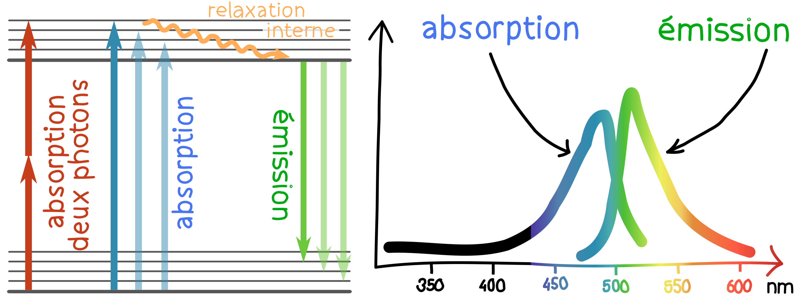
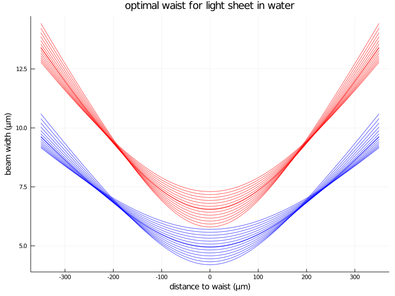
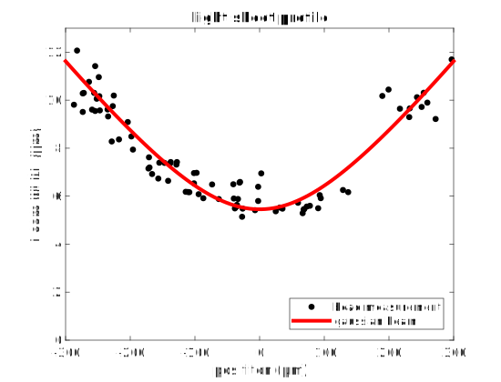
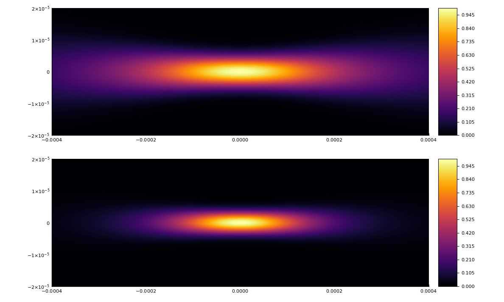
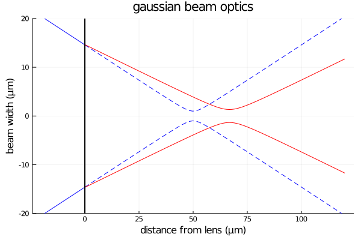

# Microscopie optique

Le principe général d'un microscope optique est d'éclairer un échantillon et d'observer la lumière qui rentre dans le système de détection. Sur un échantillon mince, on peut faire de la microscopie en transmission ou en réflexion, mais pour un échantillon biologique épais, la microscopie par fluorescence  est la technique la plus utilisée. En effet, elle permet d'imager une région précise du tissus biologique par diverses techniques de marquage fluorescent tout en contrôlant précisément la région visée par l'éclairage. Dans ce chapitre, j'aborde la technique de microscopie à feuille de lumière à un de deux photons.

## Fluorescence

La microscopie à fluorescence met en jeu le phénomène d’absorption-réémission de lumière par une molécule. La molécule absorbe un photon d'énergie élevée et émet un photon d'énergie moins élevée suite à une relaxation interne.

> Illustration du phénomène de fluorescence. À gauche point de vue quantique avec les niveaux d'énergie interne, à droite point de vue ondulatoire avec les spectres d’absorption et d'émission

Dans notre cas, la molécule fluorescente est une protéine GCaMP, introduite par modification génétique. Elle absorbe les longueurs d'onde dans le bleu et émet dans le vert. C'est pourquoi nous utilisons on laser à 488 nm pour l'imagerie un photon. De plus, un des avantages de la microscopie à fluorescence est qu'avec un jeu de filtres adapté, on peut obtenir un excellent rapport signal à bruit.  Sur la ligne de détection, on place un filtre coupe bande surnommé "notch" (_encoche_ en anglais) à la longueur d'onde du laser pour couper toute lumière venant de celui-ci. Bien que les enregistrements se déroulent dans le noir, on place aussi un filtre passe bande vert pour atténuer les résidus de luminosité ambiante venant des écrans ou des autres appareils. Ainsi, seule la lumière liée à la fluorescence est détectée.

## Sectionnement optique

Pour réaliser l'imagerie d'un échantillon biologique épais, on peut éclairer l'ensemble de l'échantillon et sélectionner une région d'observation en réglant le système optique de détection. Si le système de détection est un objectif, la région sélectionnée sera un plan dont la largeur est le champ objet de l'objectif et l'épaisseur est sa profondeur de champ. Plus un objet est hors de ce plan, plus il apparaît flou. Or pour un microscope, on travaille avec une courte focale et une grande ouverture numérique, donc la profondeur de champ est très faible. Tout objet présent dans le plan focal de l'objectif est donc imagé avec netteté, mais les objets hors de ce plan (hors focus) génèrent de la lumière parasite qui diminue la rapport signal à bruit. Cette technique ne convient donc pas lors de l'imagerie d'un échantillon dense, et il faut éliminer la lumière émise par les objets hors focus.

Il existe pour cela plusieurs techniques dites de "sectionnement optique". La plus connue, la microscopie confocale, utilise une illumination focalisée en un seul point. L'objet en ce point est fortement éclairé, et le reste beaucoup moins. De plus, un trou conjugué à ce point ne laisse passer que la lumière qui en est issue. L'imagerie d'un plan est ensuite obtenue en scannant ce point dans le plan focal, et l'imagerie d'un volume et répétant l'opération pour plusieurs couches. Cette technique est largement répandue et déclinée, et a l'avantage d'être souple et d'atteindre de bonnes résolutions. Cependant, elle ne peut pas combiner une haute définition (~10e8 voxels) à une fréquence élevée (~1Hz) et doit sacrifier l'un pour l'autre. Elle est donc réservée soit à l'observation détaillée d'échantillons statiques, soit à l'observation peu détaillée d'échantillons dynamiques.

Cette lenteur est liée au fait de scanner un point sur une surface, mais on peut gagner en vitesse en éclairant une ligne d'un coup et en remplaçant le trou par une fente, car il suffit alors de scanner dans une seule dimension. L'éclairage par une ligne peut également se faire par le côté, si l'échantillon s'y prête. De manière analogue, on peut éclairer une couche entière à l'aide d'une feuille de lumière produite par une lentille cylindrique par exemple. Je m'intéresse ici uniquement à la microscopie à nappe laser par balayage (scanning light sheet).

## Nappe laser par balayage

Le volume d'un cerveau de larve de poisson zèbre mesure 400 µm de largeur × 800 µm de longueur × 300 µm de hauteur et est situé sur le dessus de la larve. Afin de minimiser l'épaisseur de tissus traversée, on place donc l'objectif de détection sur la partie supérieure. Le laser peut donc être placé sur le côté. Les yeux sont très pigmentés et la lumière ne passe pas à travers, ce qui crée une zone d'ombre entre les yeux. Certains laboratoires qui sont intéressés par ces régions appartenant au télencéphale et au diencéphale peuvent donc ajouter un deuxième laser à l'avant pour éclairer cette région.

Pour produire un faisceau laser le plus fin possible sur une longueur de 400 µm, il faut minimiser la largeur après 200 µm de propagation avec comme variable le waist w0 placé au milieu de l'échantillon :
$$
w(z) = w_0 \, \sqrt{ 1+ {\left( \frac{z}{z_\mathrm{R}} \right)}^2 } \qquad z_\mathrm{R} = \frac{n \pi w_0^2 }{\lambda}
$$
Un waist trop petit est trop divergeant, et donc trop large sur les bords, mais un waist trop large limite la résolution. Il faut donc donc trouver un optimum. La taille d'un neurone étant de 8 µm environ, des valeurs inférieures sont souhaitables.

> on voit ici le profil gaussien à 488 nm et à 915 nm dans l'eau pour différentes valeurs du waist. Le trait épais marque la position optimale pour un faisceau de 400 µm de long.

Le waist optimum pour un échantillon de 400 µm est de 5 µm à 488 nm et de 6.5 µm à 915 nm. La largeur du faisceau à 488 nm vaut donc au mieux 5 µm au centre et 7 µm sur les bords du cerveau. À 915 nm c'est 6.5 µm au centre et 9.5 µm sur les bords mais il faut aussi prendre en compte l'effet deux photons. En pratique, la plupart des neurones sont situés entre -150 µm et +150 µm, donc un waist légèrement plus petit est également acceptable.

[TODO objectifs utilisés]

On peut vérifier que cette valeur théorique idéale est bien atteinte en pratique en utilisant des billes fluorescentes pour mesurer le profil du faisceau.

[TODO méthode de mesure par les billes]

> TODO refaire avec la nouvelle cuve + fibre HC + ...
>
> on voit ici la taille réelle du faisceau mesurée à l'aide de billes fluorescentes. La taille du waist est bien de 6 µm, ce qui donne effectivement un faisceau large de 8 µm au bord de l'échantillon

Pour effectuer le balayage, on déplace le faisceau horizontalement. Pour que l'intensité soit homogène sur une image, il faut adopter une vitesse de déplacement constante. Il est alors possible de faire un aller simple ou des allers-retours en nombre entier pendant le temps d'exposition. Pour obtenir une image volumétrique, il suffit de répéter l'opération pour plusieurs couches, en changeant le plan focal de l'objectif de détection et la position vertical de la nappe. Procéder de cette manière couche après couche force à attendre entre deux couches pour laisser le temps aux éléments mécaniques de se positionner, ce qui prend un temps (~10 ms) non négligeable pour des durées d'exposition courtes. Il est également possible de bouger les éléments mécaniques de manière continue en balayant en aller simple. Les couches sont donc légèrement obliques, mais on gagne considérablement en fréquence d'acquisition. Cela est possible grâce au mode "synchronous readout" de la caméra.

Pour un temps d'exposition par couche de 10 ms en mode d'acquisition continu, on peut par exemple réaliser un scan du cerveau à 2,5 Hz en 30 couches espacées de 8µm. Cela permet d'imager la majeure partie du cerveau du poisson. Les couches les plus profondes sont moins nettes car le signal traverse plus de tissus avant d'atteindre l'objectif, et la zone située entre les yeux reste dans l'ombre si on n'utilise qu'un laser. Mais chaque neurone visible est imagé à une fréquence de 2.5 Hz.

## Imagerie deux photons

L'absorption à deux photons est un phénomène non linéaire qui est négligeable aux petites énergies mais devient important pour une intensité lumineuse élevée. Elle peut se produire entre deux ondes de fréquence différente, mais on s'intéresse au cas particulier de deux ondes fréquences égales. Cet effet est proportionnel au carré de l'intensité lumineuse et est lié au caractère anharmonique du dipôle oscillant.

> comparaison du profil d'intensité (haut) et de son carré (bas). On voit que la zone concernée par l'effet deux photons et restreinte. (paramètres : indice optique 1.33, longueur d'onde 915 nm, waist 6.5 µm)

La zone concernée par l'effet deux photons est donc restreinte. C'est un avantage dans la direction verticale, car cela permet un meilleur sectionnement optique (en particulier au bord, où la largeur du faisceau est supérieure à la taille d'un neurone), mais c'est également un inconvénient dans la direction de propagation, car la baisse d'intensité de part et d'autre du waist est plus importante (on le verra sur les images).

Une grande intensité étant nécessaire pour produire l'effet deux photons, la focalisation décrite ci-dessus ne suffit pas, il faut également concentrer le faisceau dans la direction de propagation. Pour réaliser cette concentration, il faut produire des impulsions les plus courtes possibles. En effet, au lieu d'être répartie sur toute la longueur de propagation, la puissance d'un laser pulsé à 100 fs sera concentrée par petit paquets de 30 mm. Avec un taux de répétition de 80 MHz, la puissance moyenne d'une impulsion est alors multipliée par 125 (1/(100fs*80MHz)). Si l'on considère une impulsion à enveloppe gaussienne, la puissance crête vaut cette puissance moyenne multipliée par 
$$
2\sqrt{\frac{\ln(2)}{2\pi}} \ \simeq \ 0.939
$$
soit 117,4 W. À puissance moyenne constante, diviser par deux le taux de répétition multiplie par deux l'énergie d'une impulsion et par quatre l'effet deux photons. À énergie constante, diviser par deux la durée de l'impulsion multiplie par deux sa puissance, et par quatre l'effet deux photons. On voit donc qu'il est important de disposer d'un laser adapté et de conserver la durée de l'impulsion aussi courte que possible.

## Effet de lentille thermique

Un des problèmes auxquels j'ai été confronté est l'effet de lentille thermique. Lorsqu'un faisceau traverse un milieu absorbant, ce milieu chauffe sur la trajectoire du faisceau, ce qui change son indice optique. Le gradient d'indice ainsi formé dévie les rayons. Pour l'eau, à 915 nm, le changement d'indice est de l'ordre de -1.7e-4 par degré [1]. La température étant plus élevée au centre du faisceau, l'indice optique est plus faible, et donc la lentille équivalente est divergente. Cet effet peut être utilisé pour mesurer le coefficient d'absorption d'un liquide [3], mais il a deux conséquences gênantes dans mon cas. D'une part un effet statique lié à la perte de focalisation du faisceau altère l'effet deux-photons, d'autre part un effet dynamique lié à la réponse du système à une perturbation de la température d'équilibre dévie le faisceau lors des mouvements du microscope.

Le phénomène et a été décrit théoriquement en 1964 par Gordon *et al* [2] et en 1974 par Whinnery *et al* [3] pour une fine cellule de liquide et dans le cadre de l'approximation parabolique. En 1982, Sheldon *et al* [4] étend cette description hors de l'approximation parabolique pour prendre en compte les aberration induites. Je me contente ici de reprendre les mécaniques de bases de ces calculs pour appréhender l'amplitude des effets.

La variation de la température *T(r,t)* est décrite par l'équation de diffusion :
$$
c\rho\frac{\partial}{\partial t}[\Delta T(r,t)] = \dot{q}(r) + k \nabla^2[\Delta T(r,t)]
$$
Le terme source de l'équation lié à l'absorption du faisceau de puissance *P* par le milieu de coefficient d'absorption α vaut :
$$
\dot{q}(r) = \frac{\alpha P}{\pi w^2}\exp(-2r^2/w^2)
$$
Ce qui donne une solution de la forme :
$$
\Delta T(r,t) = \frac{\alpha P}{4\pi k} \int_0^t \left( \frac{1}{1+2t'/t_c} \right) \exp \left( \frac{-2r^2/w^2}{1+2t'/t_c} \right) \mathrm{d}t'
\\
\text{où} \ t_c = \frac{w^2}{4D}
$$
Dans notre cas, on se contentera de l'approximation au premier ordre de cette solution :
$$
\Delta T(r,t) \simeq \frac{\alpha P}{4\pi k} \left[ \ln\left( 1+\frac{2t}{t_c} \right) - \frac{2(r^2/w^2)}{1+t_c/2t} \right]
$$
Et l'on peut donc écrire l'indice optique du milieu sous la forme :
$$
n = n_0 \left( 1+\delta \left(\frac{r}{w} \right)^2 \right)
\\
\text{où} \ \delta = \frac{\mathrm{d}n}{\mathrm{d}T}\Delta T
$$
D'autre part, pour un profil d'indice quadratique tel que celui-ci et dans l'approximation des lentilles minces, on peut définir la distance focale d'une tranche de liquide d'épaisseur *l*  :
$$
f' = -\frac{w^2}{2ln_0\delta}
$$
Cela permet d'établir la valeur de la focale *F* au cours du temps :
$$
f'(t) = f'_\infty \left( 1 + \frac{t_c}{2t} \right)
\\
\text{où} \ f'_\infty = \frac{\pi kw^2}{\alpha Pl(\mathrm{d}n/\mathrm{d}T)}
$$

Cette valeur est valable pour une section mince de liquide, mais dans mon cas, le laser traverse une couche très épaisse (plusieurs centimètres). On peut donc chercher à étendre ce modèle en s'inspirant des approches utilisées pour les milieux à gradient d'indice (GRIN lens). Dans le livre *Gradient-Index Optics* (2002) [6], les auteurs s'intéressent à la propagation d'un faisceau dans un milieu d'indice d'indice égal à (équation 1.63) :
$$
n(r,z) = n_0(z) \left( 1 \pm \frac{g^2(z)}{2}r^2\right)
$$
Dans le cas d'un signe négatif (effet convergent), les calculs sont largement détaillés et aboutissent à une solution oscillante. Malheureusement le cas d'un signe positif n'est pas exploré. De plus, les solutions pour *n0(z)* non constant ne sont pas non plus détaillées. Pour obtenir un résultat en ordre de grandeur, nous avons donc opté pour un approche discrète numérique en utilisant la valeur trouvée précédemment pour la focale équivalente d'une tranche de liquide d'épaisseur *l*.

On part du principe que le faisceau reste gaussien tout au long du parcours, il peut donc être entièrement décrit pour chaque *z* par la position et la largeur de son waist. Pour chaque tranche de liquide d'épaisseur l, on peut donc écrire la formule des lentilles gaussiennes pour trouver le déplacement du waist et son élargissement.

\alpha = \frac{w_0'}{w_0} = \frac{|f'|}{\sqrt{(s+f')^2 + z_r^2}}

TODO la suite

---

On voit ici émerger un temps caractéristique d'établissement de la température d'équilibre. Le papier donne une valeur de κ de l'eau égale à 14.2e-4, soit un temps caractéristique de 5 ms dans notre cas pour une tranche fine de liquide.

---

## Conventions et formules

> exemple d'application de l'optique gaussienne à une lentille divergente de focale -200 µm

Conventions algébriques, où *O* est le centre de la lentille, *A* la position du waist objet, *A'* la position du waist image, *f'* la distance focale image de la lentille (*f'* > 0 pour une lentille convergente, *f'* < 0 pour une lentille divergente) :
$$
\overline{OA} = s
\\
\overline{OA'} = s'
\\
\overline{OF'} = f'
$$
Formule de conjugaison pour un lentille mince en optique géométrique :
$$
\frac{1}{s'} = \frac{1}{s} + \frac{1}{f'}
$$
Formule de conjugaison pour un lentille mince en optique gaussienne :
$$
\frac{1}{s'} = \frac{1}{s+\frac{z_r^2}{s+f'}} + \frac{1}{f'}
$$
Grossissement pour un faisceau gaussien :
$$
\alpha = \frac{w_0'}{w_0} = \frac{|f'|}{\sqrt{(s+f')^2 + z_r^2}}
$$

[1]: https://en.wikipedia.org/wiki/Optical_properties_of_water_and_ice "propriétés optiques de l'eau"
[2]: https://sci-hub.tw/10.1063/1.1713919 "Long‐Transient Effects in Lasers with Inserted Liquid Samples"
[3]: https://sci-hub.tw/10.1021/ar50079a003 "Laser Measurement of Optical Absorption in Liquids "
[4]: https://pdfs.semanticscholar.org/ac26/ad507bc2432a136433a53e734bf872e74f42.pdf "Laser-induced thermal lens effect: a new theoretical model"
[5]: https://sci-hub.tw/10.1016/j.optcom.2009.12.047 "Nanostructured GRIN microlenses for Gaussian beam focusing"
[6]: https://www.springer.com/fr/book/9783540421252 "Gradient-Index Optics"