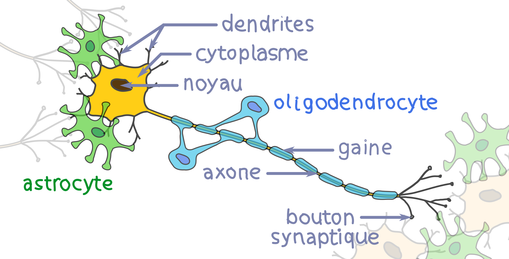
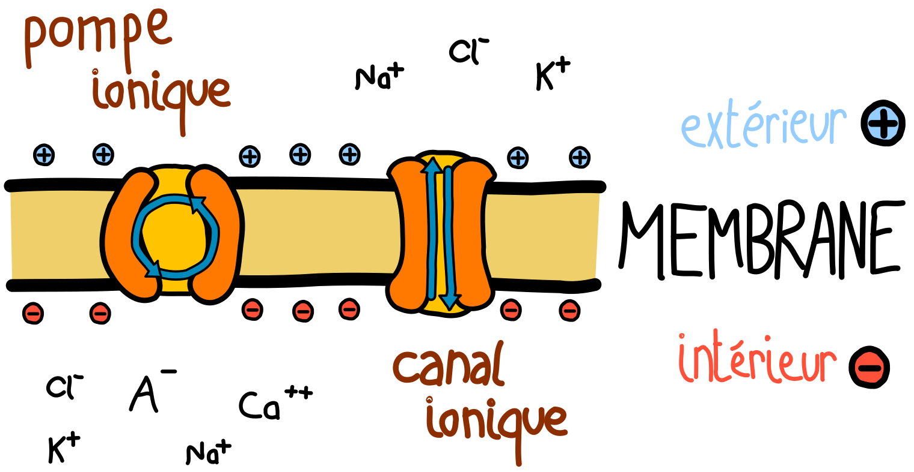
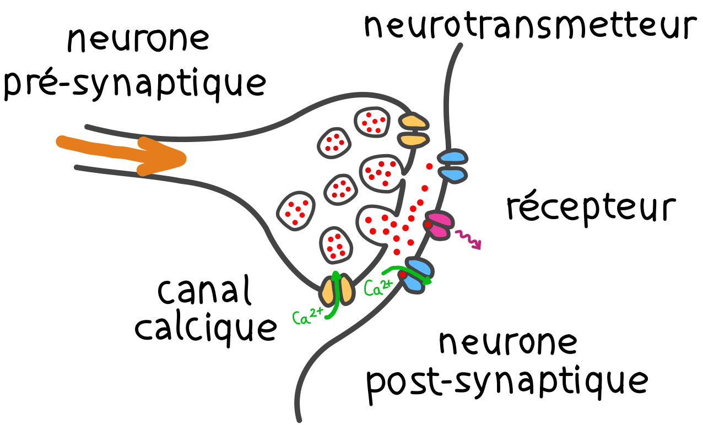

# Neurosciences

Le cerveau est un organe central dans le fonctionnement du système nerveux des animaux. Il est impliqué dans une majeure partie des phénomènes sensoriels et moteurs, et constitue le support de phénomènes cognitifs complexes comme la mémoire ou la conscience.

De nombreuses disciplines scientifiques appartenant à des domaines comme la biologie et la physique sont dédiées à son étude ; on les regroupe sous le nom de "neurosciences". Ce nom provient du mot "neurone", un élément important du système étudié que nous allons décrire sous plusieurs points de vue.

## Le neurone biologique

Du point de vue biologique, le neurone est une cellule fortement présente dans le cerveau et caractérisée par son prolongement axonal capable de transmettre un influx nerveux. Il est toujours accompagné par des cellules gliales comme les astrocytes ou les oligodendrocytes qui assurent en grande partie les fonctions métaboliques. 

Le neurone est aujourd'hui considéré comme principal responsable des processus cognitifs bien que de nombreuses recherches montrent l'importance des cellules gliales dans des phénomènes tels que l'intégration du signal calcique et l'établissement de connexions synaptiques [2,3].

> Schéma d'un neurone accompagné de cellules gliales. Astrocytes (en vert), oligodendrocytes (en bleu). Le neurone dispose d'un long prolongement appelé axone qui le connecte à d'autres neurones via des boutons synaptiques.

Le neurone est doté d'une longue projection nommée axone, qui lui permet de se connecter et transmettre un signal à d'autres neurones éloignés de lui. Comme la plupart des cellules, des protéines transmembranaires lui permettent d'atteindre une différence de potentiel avec l'extérieur de -70 mW au repos et comme d'autres cellules dites excitables, cela lui permet de transmettre un signal électrique par ouverture et fermeture de canaux ioniques.

> Des protéines transmembranaires permettent à la cellule de se polariser et de se dépolariser. Les pompes ioniques consomment de l'énergie sous forme d'ATP pour forcer le passage d'ions. Des transporteurs ioniques actifs (symport, antiport) et passifs (uniport) permettent un transport dirigé d'ions. Des canaux sélectifs et non sélectifs permettent un transport rapide.

Dans certaines conditions, le neurone connaît un phénomène de dépolarisation-repolarisation qu'on appelle potentiel d'action. Le potentiel électrique de la membrane s'inverse localement et cette inversion se propage dans le corps cellulaire le long de l'axone. À partir d'un seuil de tension, les canaux sodium s'ouvrent et laissent rentrer les ions sodium extracellulaires, ensuite, après un autre seuil de tension, les canaux potassium s'ouvrent et laissent sortir les ions potassium intracellulaires. Cela permet au potentiel d'action de se déplacer le long de l'axone jusqu'à la terminaison axonale, où les jonctions synaptiques assurent la transmission vers un autre neurone.

> Schéma de la transmission synaptique par neurotransmetteur.
>
> (1) un potentiel d'action arrive par le neurone pré-synaptique (2) des canaux calciques sensibles à la tension laissent rentrer des ions calcium (3) les vésicules fusionnent avec la membrane, libérant des neurotransmetteurs dans l'intervalle inter-neurone (4) des récepteurs spécifiques à un neurotransmetteur situés sur le neurone post-synaptique peuvent laisser entrer des ions calcium ou donner lieu à une cascade de réactions métaboliques

La plupart des synapses fonctionnent à l'aide de neurotransmetteurs. On nomme ainsi les molécules dont le rôle est de transmettre le signal à travers la jonction synaptique. Ils sont libérés dans l'espace inter-synaptique lors de l'arrivée d'un potentiel d'action dans le neurone pré-synaptique. Des récepteurs spécifiques situés sur la membrane post-synaptique laissent rentrer des ions calcium en leur présence, ce qui assure la transmission du signal.

Il existe plusieurs types de neurotransmetteurs qui peuvent avoir un effet inhibiteur ou excitateur sur le neurone post-synaptique. On compte parmi eux plusieurs acides aminés (glycine, glutamate..) et d'autres molécules proches (GABA, dopamine, adrénaline, noradrénaline, sérotonine, acétylcholine...). Certains sont également des neuromodulateurs, c'est-à-dire que leur fonction ne se limite pas à la transmission synaptique, ils peuvent se lier avec des récepteurs métabotropes entraînant des réactions cellulaires autre que l'ouverture de canaux ioniques. Les neurotransmetteurs peuvent concerner spécifiquement certaines populations de neurones, on parle par exemple de neurones gabaergiques, dopaminergiques... Leur présence peut être révélée à l'aide d'anticorps liés à une protéine fluorescente, ce qui permet d'identifier des zones spécifiques. Le Z-brain atlas permet par exemple de visualiser l'emplacement des neurones à sérotonine (5HT), GABA, dopamine, glycine, glutamate... Les distinguer est important car ils montrent des comportements très différents [5]. Par exemple, chez l'humain, la sérotonine est impliquée dans les humeurs, la dopamine joue un rôle dans la motivation, l'adrénaline est reliée à l'effort physique...

## Le neurone chimique

Comme dit précédemment, chaque cellule crée une différence de potentiel entre le milieu intracellulaire et extracellulaire. Ce potentiel électrochimique est une source d'énergie qui sert de moteur aux processus chimiques transmembranaires. Pour chaque ion, on peut donc écrire l'équation du potentiel membranaire (équation de Nernst) :
$$
V_m = - \frac{RT}{z_iF} \ln \left(\frac{[I]_{\text{extra}}}{[I]_{\text{intra}}}\right)
$$

TODO concentration des ions équilibre / dépolarisation

| Ion                                                          | Concentration intracellulaire (mmol/l) | Concentration extracellulaire (mmol/l) | Rapport | Potentiel d'équilibre d'après l'[équation de Nernst](https://fr.wikipedia.org/wiki/Équation_de_Nernst) |
| ------------------------------------------------------------ | -------------------------------------- | -------------------------------------- | ------- | ------------------------------------------------------------ |
| Na+                                                          | 20                                     | 140                                    | 1:7     | env. +51 mV                                                  |
| K+                                                           | 150                                    | 4                                      | 38:1    | -97 mV                                                       |
| Ca2+                                                         | 1e-4                                   | 1.8                                    |         | +120 mV                                                      |
| Cl-                                                          | 20                                     | 100                                    |         | -42 mV                                                       |
| HCO3-                                                        | 8-10                                   | 26-28                                  |         | -27 mV                                                       |
| Protéine [anionique](https://fr.wikipedia.org/wiki/Anion) (chargée négativement) | 155                                    | 5                                      |         | -75 mV                                                       |

 Un ion particulièrement important dans les mécanismes de signaux intracellulaires est le calcium.

## Le neurone physique

TODO état critique, différents régimes du PA

## Le neurone logique

## Lexique

Ion channels, pumps, exchangers

- **NaLCN** sodium leak channel, non-selective
- **BK** calcium-activated big potassium channels
- **VGNaC** voltage gated sodium channels
- **NSCC** non-selective cation channel
- **VGCC** voltage gated cation channel
- **NCX** sodium-calcium exchanger
- **PMCA** plasma membrane Ca2+ ATPase
- **SERCA** sarco endoplasmic reticulum Ca2+-ATPase

Neurotransmitter receptors

- **mGluRs** metabotropic glutamate receptors
- **CaSR** calcium sensing receptor
- **nAChR** nicotinic acetylcholine receptor
- **NMDA-r** N-methyl-D-aspartate receptor
- **AMPA-r**  α-amino-3-hydroxy-5-méthylisoazol-4-propionate (AMPA) receptor

Others

- **CALHM1** calcium homeostasis modulator 1 (pore-forming subunit of a voltage-gated ion channel)

## Références

[1]: https://sci-hub.tw/10.1016/j.biocel.2004.02.023 "Glial cells (Jessen, 2004)"
[2]: https://www.sciencedirect.com/science/article/abs/pii/0166223696100485 "Calcium signaling in glial cells (1996)"
[3]: https://science.sciencemag.org/content/277/5332/1684.1.abstract "Synaptic Efficacy Enhanced by Glial Cells in Vitro (1997)"
[4]: https://www.sciencedirect.com/science/article/abs/pii/S0960077920303507 "Astrocyte-induced intermittent synchronization of neurons in a minimal network"
[5]: https://www.cell.com/cell/fulltext/S0092-8674(17)31243-6 "Ancestral Circuits for the Coordinated Modulation of Brain State (MultiMAP: registering brain-wide cellular-resolution dynamics with molecular identity)"