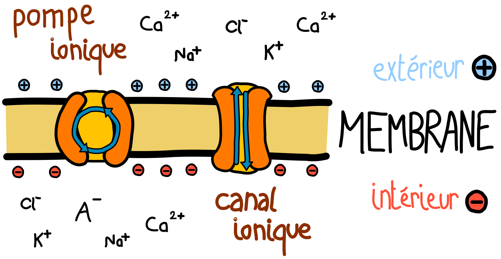

# Neurosciences

Le cerveau est un organe central dans le fonctionnement du système nerveux des animaux. Il est impliqué dans une majeure partie des phénomènes sensoriels et moteurs, et constitue le support de phénomènes cognitifs complexes comme la mémoire ou la conscience.

De nombreuses disciplines scientifiques appartenant à des domaines comme la biologie et la physique sont dédiées à son étude ; on les regroupe sous le nom de "neurosciences". Ce nom provient du mot "neurone", un élément important du système étudié que nous allons décrire sous plusieurs points de vue.

## Le neurone biologique

Du point de vue biologique, le neurone est une cellule fortement présente dans le cerveau et caractérisée par son prolongement axonal capable de transmettre un influx nerveux. Il est toujours accompagné par des cellules gliales comme les astrocytes ou les oligodendrocytes qui assurent en grande partie les fonctions métaboliques. 

Le neurone est aujourd'hui considéré comme principal responsable des processus cognitifs bien que de nombreuses recherches montrent l'importance des cellules gliales dans des phénomènes tels que l'intégration du signal calcique et l'établissement de connexions synaptiques [2,3].

> Schéma d'un neurone accompagné de cellules gliales. Astrocytes (en vert), oligodendrocytes (en bleu). Le neurone dispose d'un long prolongement appelé axone qui le connecte à d'autres neurones via des boutons synaptiques.

Le neurone est doté d'une longue projection nommée axone, qui lui permet de se connecter à d'autres neurones éloignés de lui. Un signal électrique se propage de neurone en neurone, ce qui permet de donner lieu à des dynamiques complexes.

Pour créer ce signal électrique, le neurone doit se polariser et dépolariser, ce qu'il fait grâce à des protéines transmembranaires. Lors de la polarisation, des pompes ioniques consomment de l'ATP pour transmettre des ions (comme Sodium et Potassium) de l'intérieur vers l'extérieur et des transporteurs passifs (symport, antiport, uniport) tels que 

## Le neurone physique

## Le neurone logique

[1]: https://sci-hub.tw/10.1016/j.biocel.2004.02.023 "Glial cells (Jessen, 2004)"
[2]: https://www.sciencedirect.com/science/article/abs/pii/0166223696100485 "Calcium signaling in glial cells (1996)"
[3]: https://science.sciencemag.org/content/277/5332/1684.1.abstract "Synaptic Efficacy Enhanced by Glial Cells in Vitro (1997)"